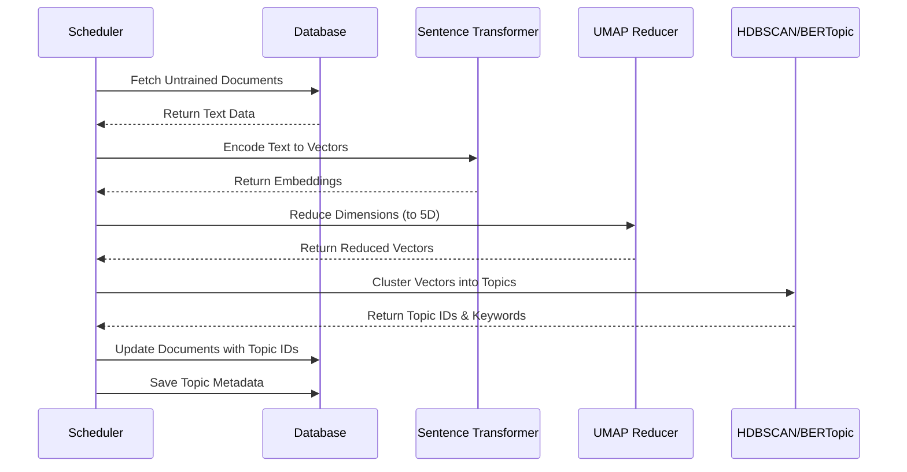

# Building a Real-Time Multimodal Tech News Monitor with FastAPI, React, and BERTopic

In the fast-paced world of technology, keeping up with the latest trends across thousands of articles and videos is a daunting task. Information overload is real, and finding the signal in the noise is harder than ever.

What if we could build a system that automatically watches the news for us, reads every article, watches every video, and groups them into coherent, evolving topics?

In this post, we’ll explore how to build a **Multimodal News Topic Monitoring System** that does exactly that. We’ll dive into the architecture, the code, and the AI magic that powers it.

---

## 🚀 What We Built

We created an end-to-end full-stack application that:
1.  **Ingests Data**: Fetches tech news from articles (NewsAPI) and video transcripts (YouTube).
2.  **Processes with AI**: Uses **BERTopic** and **Sentence Transformers** to cluster these documents into meaningful topics.
3.  **Tracks Evolution**: Monitors how these topics grow and change over time.
4.  **Visualizes Results**: Presents a clean, interactive dashboard for users to explore the data.

---

## 🏗️ System Architecture

The system is designed as a set of microservices orchestrated by Docker. This ensures consistency and makes deployment a breeze.

```mermaid
graph TD
    subgraph "Data Sources"
        NewsAPI[NewsAPI Articles]
        YouTube[YouTube Transcripts]
    end

    subgraph "Backend Service (FastAPI)"
        Scheduler[APScheduler]
        API[FastAPI Endpoints]
        NLP[NLP Pipeline (BERTopic)]
    end

    subgraph "Storage"
        DB[(PostgreSQL)]
        ModelStore[Model Files]
    end

    subgraph "Frontend Service"
        React[React Dashboard]
    end

    NewsAPI -->|JSON| Scheduler
    YouTube -->|JSON| Scheduler
    Scheduler -->|Raw Data| DB
    Scheduler -->|Trigger| NLP
    NLP -->|Fetch Data| DB
    NLP -->|Save Topics| DB
    NLP -->|Save Model| ModelStore
    React -->|HTTP Requests| API
    API -->|Query| DB
```

### The Core Components

1.  **Database (PostgreSQL)**: The single source of truth. It stores raw documents (articles/videos), discovered topics, and temporal data (how topics change over time).
2.  **Backend (FastAPI)**: The brain of the operation. It exposes a REST API for the frontend and runs background jobs to ingest data and retrain the AI models.
3.  **NLP Engine**: Powered by **BERTopic**, this component converts text into vector embeddings and clusters them to find hidden patterns.
4.  **Frontend (React + Chakra UI)**: A modern, responsive dashboard that lets users interact with the data through charts and lists.

---

## 🧠 The AI Engine: How It Works

The heart of this project is the `nlp_pipeline.py` module. Here's the flow of data through the AI engine:



We use **Sentence-Transformers** (`all-MiniLM-L6-v2`) to convert text into dense vector representations. Then, **BERTopic** handles the heavy lifting of dimensionality reduction and clustering to identify distinct topics like "AI Startups," "Crypto Regulations," or "New iPhone Launch."

---

## 📂 Project Structure

Here's a quick tour of the codebase:

### Backend (`/backend/app`)
*   `main.py`: The entry point. Sets up the FastAPI app, CORS, and the background scheduler.
*   `nlp_pipeline.py`: Contains the logic for training and updating the BERTopic model.
*   `models.py`: SQLAlchemy definitions for `Document`, `Topic`, and `TemporalData` tables.
*   `crud.py`: Helper functions to interact with the database.

### Frontend (`/frontend/src`)
*   `App.js`: Sets up routing using `react-router-dom`.
*   `components/Dashboard.js`: The main view. Uses `recharts` to show topic trends over time.
*   `components/TopicExplorer.js`: A detailed view to drill down into specific topics and see the underlying articles.

### Scripts (`/scripts`)
*   `ingest_articles.py` & `ingest_videos.py`: Standalone scripts to fetch initial data from external APIs and save them as JSON files for the backend to consume.

---

## 🌟 Key Features

### 1. Multimodal Ingestion
The system doesn't just read news; it *watches* it. By using `youtube-transcript-api`, we treat video content just like text articles, allowing the model to find connections between a TechCrunch article and a MKBHD video review.

### 2. Temporal Evolution
Topics aren't static. The system tracks the frequency of topics over time, allowing users to spot rising trends or fading fads. This is visualized with a dynamic line chart on the dashboard.

### 3. Automated Lifecycle
Thanks to `APScheduler`, the system is self-sustaining:
*   **Every 6 hours**: It checks for new data.
*   **Every 24 hours**: It retrains the model to incorporate new information, ensuring the topics remain relevant.

---

## 🛠️ How to Run

Getting this running is easy thanks to Docker.

### Prerequisites
*   Docker & Docker Compose
*   API Keys for NewsAPI and YouTube Data API

### Steps
1.  **Clone the repo** and set up your `.env` file with your API keys.
2.  **Build the stack**:
    ```bash
    docker-compose build
    ```
3.  **Start the Database**:
    ```bash
    docker-compose up -d db
    ```
4.  **Ingest Initial Data**:
    ```bash
    # Install local deps
    pip install newsapi-python newspaper3k google-api-python-client youtube-transcript-api python-dotenv
    
    # Run ingestion scripts
    python scripts/ingest_articles.py
    python scripts/ingest_videos.py
    ```
5.  **Launch the App**:
    ```bash
    docker-compose up -d backend frontend
    ```
6.  **Trigger Training**:
    ```bash
    curl -X POST http://localhost:8000/api/train
    ```

Visit `http://localhost:3000` to see your dashboard in action!

---

## 🔮 Conclusion

This project demonstrates the power of combining modern web frameworks with state-of-the-art NLP. By automating the consumption and organization of information, we can build tools that help us stay informed without the burnout.

**Future Enhancements?**
*   **Real-time WebSocket updates** for the frontend.
*   **Sentiment Analysis** to see if news about a topic is positive or negative.
*   **LLM Integration** to generate summaries for each topic.

The possibilities are endless when you have a structured feed of the world's information. Happy coding!
